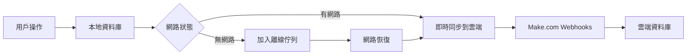

# 🗄️ Tanawat Restaurant 資料儲存系統

## 📊 系統架構概覽

這套餐廳管理系統採用 **三層式資料儲存架構**，確保資料的可靠性、即時性和離線可用性：

```
┌─────────────────────────────────────────────────────────────┐
│                    資料儲存架構                               │
├─────────────────────────────────────────────────────────────┤
│ 🌐 雲端層 (Make.com Webhooks)                               │
│   ├── 即時資料同步                                          │
│   ├── 跨裝置資料共享                                        │
│   └── 自動備份機制                                          │
├─────────────────────────────────────────────────────────────┤
│ 💾 本地資料庫 (IndexedDB)                                   │
│   ├── 快速資料存取                                          │
│   ├── 離線模式支援                                          │
│   └── 結構化資料儲存                                        │
├─────────────────────────────────────────────────────────────┤
│ 📁 檔案備份 (CSV)                                           │
│   ├── 資料初始化                                            │
│   ├── 歷史記錄保存                                          │
│   └── 系統還原點                                            │
└─────────────────────────────────────────────────────────────┘
```

## 🎯 資料儲存方案

### 1. **本地資料庫 (IndexedDB)**
- **用途**: 主要資料儲存，支援離線操作
- **優點**: 
  - ✅ 快速存取，無網路延遲
  - ✅ 支援複雜查詢和索引
  - ✅ 離線時仍可正常操作
  - ✅ 資料結構化，易於管理

### 2. **雲端同步 (Notion API - 推薦)**
- **用途**: 直接與 Notion 資料庫整合，即時同步
- **優點**:
  - ✅ 直接 API 整合，無中間層延遲
  - ✅ 完整的 CRUD 操作支援
  - ✅ 結構化資料儲存在 Notion
  - ✅ 支援複雜查詢和過濾
  - ✅ 天然的協作和分享功能
  - ✅ 無需額外的雲端服務費用

### 3. **雲端同步 (Make.com Webhooks - 備用)**
- **用途**: 透過 Make.com 進行資料同步 (備用方案)
- **優點**:
  - ✅ 可整合多種外部服務
  - ✅ 視覺化流程設計
  - ✅ 豐富的整合選項
  - ✅ 適合複雜的自動化需求

### 4. **CSV 檔案備份**
- **用途**: 初始資料載入，歷史備份
- **優點**:
  - ✅ 人類可讀格式
  - ✅ 易於匯入/匯出
  - ✅ 與既有系統相容
  - ✅ 簡單的備份還原

## 📁 資料表結構

### 🍽️ 訂單表 (orders)
```javascript
{
  id: "自動產生ID",
  tableNumber: "桌號",
  items: "訂單項目陣列",
  status: "進行中|已完成|已取消",
  totalAmount: "總金額",
  timestamp: "建立時間",
  createdAt: "建立時間戳",
  updatedAt: "更新時間戳"
}
```

### 🥘 菜單表 (menu)
```javascript
{
  id: "自動產生ID",
  name: "菜品名稱",
  category: "分類",
  price: "價格",
  description: "描述",
  available: "是否供應",
  createdAt: "建立時間戳",
  updatedAt: "更新時間戳"
}
```

### 🪑 桌況表 (tables)
```javascript
{
  tableNumber: "桌號 (主鍵)",
  status: "空桌|已佔用|清潔中",
  capacity: "容納人數",
  location: "位置",
  createdAt: "建立時間戳",
  updatedAt: "更新時間戳"
}
```

### 📅 訂位表 (reservations)
```javascript
{
  id: "自動產生ID",
  customerName: "客戶姓名",
  phone: "聯絡電話",
  date: "預約日期",
  time: "預約時間",
  partySize: "人數",
  tableNumber: "指定桌號",
  status: "已預約|已到達|已取消",
  createdAt: "建立時間戳",
  updatedAt: "更新時間戳"
}
```

### 📦 庫存表 (inventory)
```javascript
{
  id: "自動產生ID",
  itemName: "商品名稱",
  category: "分類",
  currentStock: "目前庫存",
  minStock: "最低庫存",
  unit: "單位",
  lastUpdated: "最後更新時間",
  createdAt: "建立時間戳",
  updatedAt: "更新時間戳"
}
```

### 🛒 採購表 (purchases)
```javascript
{
  id: "自動產生ID",
  supplierId: "供應商ID",
  items: "採購項目陣列",
  totalAmount: "總金額",
  status: "已下單|已收貨|已付款",
  orderDate: "下單日期",
  createdAt: "建立時間戳",
  updatedAt: "更新時間戳"
}
```

### 👨‍🍳 食譜表 (recipes)
```javascript
{
  id: "自動產生ID",
  menuItemId: "對應菜單項目ID",
  ingredients: "食材陣列",
  instructions: "製作步驟",
  cookingTime: "烹飪時間",
  difficulty: "困難度",
  createdAt: "建立時間戳",
  updatedAt: "更新時間戳"
}
```

### 🏪 供應商表 (suppliers)
```javascript
{
  id: "自動產生ID",
  name: "供應商名稱",
  category: "供應類別",
  contact: "聯絡電話",
  email: "電子郵件",
  address: "地址",
  createdAt: "建立時間戳",
  updatedAt: "更新時間戳"
}
```

## 🔧 使用方法

### 0. **Notion API 設定 (推薦)**

#### 步驟 1: 建立 Notion Integration
1. 前往 [Notion Developers](https://developers.notion.com/)
2. 點擊 "My integrations" → "New integration"
3. 輸入 Integration 名稱 (例如: Tanawat Restaurant)
4. 選擇 Associated workspace
5. 複製生成的 **Internal Integration Token**

#### 步驟 2: 建立 Notion 資料庫
為每個資料表建立對應的 Notion 資料庫：

**菜單資料庫 (Menu)**
- 名稱 (Title)
- 分類 (Text)
- 價格 (Number)
- 描述 (Text)
- 供應狀態 (Checkbox)

**訂單資料庫 (Orders)**
- 桌號 (Text)
- 狀態 (Select: 進行中, 已完成, 已取消)
- 總金額 (Number)
- 訂單項目 (Text)
- 建立時間 (Date)

**桌況資料庫 (Tables)**
- 桌號 (Title)
- 狀態 (Select: 空桌, 已佔用, 清潔中)
- 容納人數 (Number)
- 位置 (Text)

#### 步驟 3: 設定權限
1. 開啟每個資料庫頁面
2. 點擊右上角 "..." → "Add connections"
3. 選擇您剛建立的 Integration
4. 複製每個資料庫的 ID (URL 中的 32 字元字串)

#### 步驟 4: 設定系統
在 `config/config.js` 中填入設定：

```javascript
notion: {
    apiKey: 'secret_xxxxxxxxxxxxxxxxxxxxxxxxxxxxx', // 您的 Integration Token
    apiVersion: '2022-06-28',
    databaseIds: {
        menu: 'xxxxxxxx-xxxx-xxxx-xxxx-xxxxxxxxxxxx',        // 菜單資料庫 ID
        orders: 'xxxxxxxx-xxxx-xxxx-xxxx-xxxxxxxxxxxx',      // 訂單資料庫 ID
        tables: 'xxxxxxxx-xxxx-xxxx-xxxx-xxxxxxxxxxxx',      // 桌況資料庫 ID
        reservations: 'xxxxxxxx-xxxx-xxxx-xxxx-xxxxxxxxxxxx', // 預約資料庫 ID
        inventory: 'xxxxxxxx-xxxx-xxxx-xxxx-xxxxxxxxxxxx',   // 庫存資料庫 ID
        // ... 其他資料庫 ID
    }
},
syncMethod: 'notion' // 使用 Notion API 作為主要同步方式
```

### 1. **基本 CRUD 操作**
```javascript
// 新增資料
await DataManager.add('orders', {
  tableNumber: '5',
  items: [{ name: '紅燒肉', quantity: 1, price: 180 }],
  status: '進行中',
  totalAmount: 180
});

// 讀取資料
const order = await DataManager.get('orders', 1);
const allOrders = await DataManager.getAll('orders');

// 更新資料
await DataManager.update('orders', {
  id: 1,
  status: '已完成'
});

// 刪除資料
await DataManager.delete('orders', 1);
```

### 2. **條件查詢**
```javascript
// 依狀態查詢訂單
const activeOrders = await DataManager.getAll('orders', 'status', '進行中');

// 依桌號查詢訂單
const tableOrders = await DataManager.getAll('orders', 'tableNumber', '5');
```

### 3. **資料備份和還原**
```javascript
// 備份所有資料
const backup = await DataManager.backup();

// 還原資料
await DataManager.restore(backupData);
```

## 🌐 離線支援

系統具備完整的離線工作能力：

1. **離線操作**: 沒有網路時仍可正常使用
2. **自動佇列**: 離線時的操作會暫存在佇列中
3. **自動同步**: 網路恢復後自動同步到雲端
4. **衝突處理**: 智慧處理資料衝突

## 🔄 資料同步機制



## 🛠️ 開發者工具

在開發環境中，系統會提供便利的開發者工具：

- **資料重置**: 清空所有資料重新開始
- **資料匯出**: 下載完整資料備份
- **資料匯入**: 從備份檔案還原資料
- **即時監控**: 查看資料操作日誌

## 📈 效能優化

1. **索引優化**: 重要欄位建立索引加速查詢
2. **分頁載入**: 大量資料分批載入
3. **快取機制**: 常用資料快取在記憶體
4. **背景同步**: 不阻塞 UI 的背景同步

## 🔒 資料安全

1. **本地加密**: 敏感資料在本地加密儲存
2. **傳輸加密**: 使用 HTTPS 傳輸資料
3. **權限控制**: 不同角色有不同資料存取權限
4. **定期備份**: 自動定期備份重要資料

## 🚀 部署建議

### 開發環境
```bash
# 1. 直接開啟 index.html
# 2. 使用本地 HTTP 伺服器
python -m http.server 8000
```

### 生產環境
```bash
# 1. 部署到 Netlify/Vercel
# 2. 設定正確的 Make.com Webhook URLs
# 3. 啟用 HTTPS
```

---

這套資料儲存系統提供了完整的餐廳營運資料管理解決方案，既保證了資料的可靠性，也確保了系統的可用性和擴展性！🎉
